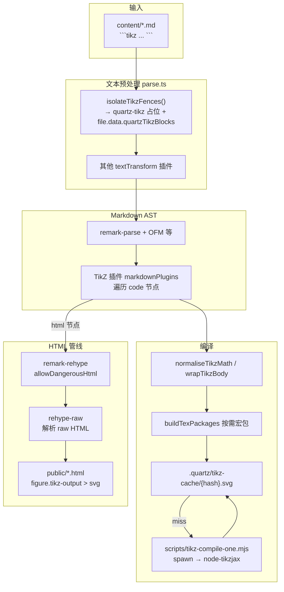

# Quartz 构建期 TikZ 渲染技术说明

本文档说明本仓库如何在 **Quartz 静态站点构建** 阶段，将 Markdown 中的 ` ```tikz ` 代码块编译为 **SVG** 并写入最终 HTML。方案与 Obsidian 插件 [obsidian-tikzjax](https://github.com/artisticat1/obsidian-tikzjax) 的写法兼容，但渲染发生在 **Node.js 构建时**，而非浏览器运行时。

---

## 1. 设计目标与约束

| 目标 | 说明 |
|------|------|
| 与 Obsidian 工作流一致 | 作者在笔记里写 ` ```tikz `，无需手工导出 PNG/SVG |
| 静态输出 | 生成 `<svg>` 嵌入 HTML，不依赖访客安装 LaTeX 或 wasm |
| 可缓存 | 相同源码 + 编译选项命中磁盘缓存，加速增量构建 |
| 隔离失败 | 单图编译失败不拖垮整站；错误在页面与终端可见 |

| 约束 | 说明 |
|------|------|
| 编译器 | [node-tikzjax](https://www.npmjs.com/package/node-tikzjax)（WebAssembly TeX → DVI → SVG） |
| 非完整 TeX Live | 仅支持其内置宏包集合；部分字体/宏与本地 LaTeX 不一致 |
| 进程模型 | 每张图在**独立子进程**中编译（避免 wasm 状态串扰；与 upstream 建议一致） |

---

## 2. 总体架构



**数据流一句话**：Markdown 原文 → 提前抽出 TikZ 正文 → 解析为 MDAST → TikZ 插件把 `code` 换成带 SVG 的 `html` → rehype 把 raw HTML 变成真实 DOM 节点 → 静态页。

---

## 3. 涉及文件

| 路径 | 职责 |
|------|------|
| `quartz.ts` | 注册 `TikZ` 插件，并 **`unshift` 到 transformers 最前** |
| `quartz/plugins/transformers/tikz.ts` | 核心：隔离 fence、规范化、编译、缓存、AST 替换 |
| `quartz/processors/parse.ts` | 在 `remark-parse` 之前调用 `isolateTikzFences`；HTML 阶段启用 `rehype-raw` |
| `scripts/tikz-compile-one.mjs` | 子进程入口：读 stdin JSON → `tex2svg` → stdout 输出 SVG |
| `scripts/verify-build.mjs` | 构建后统计 `tikz-output` / `tikz-error` |
| `.quartz/tikz-cache/` | 编译结果缓存（可删除后全量重编） |
| `package.json` | 依赖 `node-tikzjax`、`rehype-raw` |

---

## 4. 插件注册顺序（关键）

```7:9:quartz.ts
const tikz = TikZ({ enableTikZ: true })
// TikZ must run before OFM/LaTeX markdown transforms so ```tikz fences stay intact.
transformers.unshift(tikz)
```

**原因**：Obsidian Flavored Markdown（OFM）等扩展在解析阶段可能错误处理超长的 `tikz` 代码块。TikZ 插件虽在 MDAST 阶段才编译，但配合下一节的 **fence 隔离**，必须在整体 transformer 链中优先注册，且隔离发生在 **parse 之前**。

---

## 5. 阶段 A：Fence 隔离（`isolateTikzFences`）

在 `createFileParser` 里，`processor.parse(file)` **之前**执行：

```98:100:quartz/processors/parse.ts
        file.value = file.value.toString().trim()
        file.value = isolateTikzFences(file)
```

### 5.1 做什么

1. **`sanitiseMarkdownForQuartz`**：把 `$$\begin{array}{|c|...}$$` 临时改成 `matrix`，避免 micromark 把 `|` 当成 GFM 表格语法，导致后续内容（含 tikz fence）解析错乱。
2. **正则提取** 所有 ` ```tikz ` 块（允许反引号后空格：`` ``` tikz ``）。
3. 正文存入 `file.data.quartzTikzBlocks: string[]`。
4. 原文替换为轻量占位：

   ````markdown
   ```quartz-tikz
   0
   ```
   ````

### 5.2 为什么需要占位

- OFM / micromark 对「极长、多行、含大量反斜杠」的 fence 不稳定，可能吞块或截断。
- 占位块只有一行数字，解析可靠；真实 TeX 源码保存在 `VFile.data` 里，编译时再取回。

### 5.3 恢复源码

MDAST 阶段遇到 `lang === "quartz-tikz"` 的 `code` 节点时，`resolveTikzSource` 用索引从 `quartzTikzBlocks[id]` 读取；若 `lang === "tikz"`（未走隔离的兜底）则直接用 `node.value`。

---

## 6. 阶段 B：MDAST 变换（TikZ 插件）

插件只实现 `markdownPlugins()`，在 unified 的 **MDAST → MDAST** 链中运行。

### 6.1 遍历与替换

1. `visit(tree, "code", ...)` 收集所有 `tikz` / `quartz-tikz` 代码块。
2. 对每一块依次：恢复源码 → 规范化 → 编译 → 将 `parent.children[index]` 替换为：

   **成功**：

   ```html
   <figure class="tikz-output">{svg 字符串}</figure>
   ```

   **失败**：

   ```html
   <pre class="tikz-error">TikZ 渲染失败: …</pre>
   ```

节点类型为 `html`（原始 HTML 字符串），不是 `code`。

### 6.2 文档包裹（`wrapTikzBody`）

与 obsidian-tikzjax 一致：若正文已含 `\begin{document}`，原样使用；否则自动包裹：

```latex
\begin{document}
{用户正文}
\end{document}
```

node-tikzjax 使用 `standalone` 文档类；用户块内可写 `\usepackage`、`\usetikzlibrary`、`\begin{tikzpicture}` 等。

### 6.3 源码规范化（`normaliseTikzMath`）

构建前对 TeX 字符串做确定性清洗，减少 wasm TeX 与「从 Word/Obsidian 粘贴」导致的环境差异：

| 处理 | 原因 |
|------|------|
| `\r\n` → `\n` | 统一换行 |
| `\boldsymbol` → `\mathbf` | wasm 环境常缺粗体数学字体（如 `cmmib5`） |
| `\hat{\boldsymbol{…}}` → `\hat{\mathbf{…}}` | 同上 |
| `\begin{tikzcd}` 后多余空行 | 触发 `Missing $ inserted` |
| `\end{tikzcd}` 前多余空行 | 同上 |
| `\usepackage{…}` 与 `\begin{document}` 间双空行 | 同上 |
| NBSP / 零宽字符等 | 破坏 TeX 词法 |

### 6.4 宏包策略（`buildTexPackages`）

**不要**把 node-tikzjax 支持的全部宏包都 `\usepackage` 进 preamble——会导致 `TeX capacity exceeded`，且有时进程仍返回“成功”但 SVG 内嵌 TeX 日志。

当前策略：**按源码特征推断**，且跳过用户已写的包：

| 宏包 | 触发条件（正则） |
|------|------------------|
| `tikz-cd` | `\begin{tikzcd}` |
| `chemfig` | `\chemfig` |
| `pgfplots` | `\begin{axis}`、`\addplot` |
| `circuitikz` | `\begin{circuitikz}` |
| `tikz-3dplot` | `\tdplot…` |
| `amsmath` / `amssymb` / `amsfonts` | 对应环境或命令 |

用户可在 `quartz.ts` 通过 `TikZ({ texPackages: { … } })` 追加全局宏包。

**TikZ 库**（默认经 `tikzLibraries` 注入 preamble）：

```text
arrows.meta,calc,decorations.markings,decorations.pathreplacing,positioning
```

**pgfplots 兼容**：仅当推断或配置需要 `pgfplots` 时，才附加 `addToPreamble` 中的 `\pgfplotsset{compat=1.16}`。

### 6.5 编译子进程

```169:176:quartz/plugins/transformers/tikz.ts
function compileTikzToSvg(source: string, options: CompileOptions): string {
  const payload = JSON.stringify({ source, options })
  const result = spawnSync(process.execPath, [COMPILE_SCRIPT], {
    input: payload,
    encoding: "utf8",
    maxBuffer: 64 * 1024 * 1024,
    timeout: 180_000,
  })
```

`scripts/tikz-compile-one.mjs` 从 stdin 读取 `{ source, options }`，调用 `node-tikzjax` 的 `tex2svg`，将 SVG 写到 stdout。每张图一次进程，超时 180s。

**传入 node-tikzjax 的 options**（主要字段）：

| 字段 | 本仓库默认 | 含义 |
|------|------------|------|
| `texPackages` | 按需推断 | 额外 `\usepackage{pkg}[opts]` |
| `tikzLibraries` | 见上 | `\usetikzlibrary{…}` |
| `addToPreamble` | pgfplots 时才有 | 追加到 preamble 的 TeX |
| `embedFontCss` | `true` | SVG 内引用 CDN 数学字体 CSS |
| `showConsole` | `TIKZ_DEBUG=1` 时开启 | 在子进程 stderr 打印 TeX 日志 |

### 6.6 缓存

- 目录：`.quartz/tikz-cache/`
- 键：`sha256(规范化后源码 + JSON.stringify(compileOpts))`
- 命中则跳过子进程；若缓存 SVG 含 `TeX capacity exceeded` 等（`svgLooksBroken`），视为无效并重新编译。

修改 `normaliseTikzMath` 或 `buildTexPackages` 后，建议删除缓存目录再构建。

### 6.7 失败回退

1. 首次编译失败时，若源码含 `\mathbf` 或 `amssymb`/`amsfonts`，尝试去掉粗体与相关宏包再编一次。
2. 仍失败则在页面插入 `tikz-error`，并在终端打印 `[TikZ] {slug} block {index}: …`。

---

## 7. 阶段 C：HTML 管线（`rehype-raw`）

TikZ 插件输出的是 MDAST `html` 节点。`remark-rehype` 默认将其变为 HAST 中的 **raw 文本**，不会变成 `<figure>` / `<svg>` 元素。

```38:48:quartz/processors/parse.ts
export function createHtmlProcessor(ctx: BuildCtx): QuartzHtmlProcessor {
  const transformers = ctx.cfg.plugins.transformers
  return (
    unified()
      .use(remarkRehype, { allowDangerousHtml: true })
      .use(rehypeRaw)
      .use(transformers.flatMap((plugin) => plugin.htmlPlugins?.(ctx) ?? []))
  )
}
```

- `allowDangerousHtml: true`：允许 raw HTML 进入 HAST。
- `rehype-raw`：把 raw 字符串解析为真正的元素节点，SVG 才会出现在最终 DOM 中。

**排错提示**：若构建日志无 TikZ 报错但页面上只有代码块或空白，优先检查是否缺少 `rehype-raw`。

---

## 8. 作者写法（Obsidian / Markdown）

### 8.1 最小示例

````markdown
```tikz
\begin{tikzpicture}
  \draw (0,0) circle (1);
\end{tikzpicture}
```
````

### 8.2 推荐完整结构（复杂图）

````markdown
```tikz
\usepackage{tikz}
\usetikzlibrary{arrows.meta, calc}

\begin{document}
\begin{tikzpicture}[>=Stealth]
  \draw[->] (0,0) -- (2,1) node[right] {$\vec{v}$};
\end{tikzpicture}
\end{document}
```
````

### 8.3 写作规范（避免 wasm TeX 踩坑）

1. 在块内显式 `\usepackage{…}` / `\usetikzlibrary{…}`；插件只补**缺省且必要**的包。
2. **tikz-cd**：`\begin{tikzcd}` 下一行直接写节点，避免中间空行；`\end{tikzcd}` 前不要多留空行。
3. 优先 `\mathbf`、`\vec`，少用 `\boldsymbol`。
4. 避免从 Word 粘贴（易带 U+00A0 等不可见字符）。
5. 特别大的图可拆成多个 ` ```tikz ` 块，降低单次 wasm 内存压力。

### 8.4 node-tikzjax 内置可用宏包（摘录）

`chemfig`, `tikz-cd`, `circuitikz`, `pgfplots`, `array`, `amsmath`, `amstext`, `amsfonts`, `amssymb`, `tikz-3dplot` 等——以 [node-tikzjax README](https://www.npmjs.com/package/node-tikzjax) 为准。

---

## 9. 构建、调试与验收

### 9.1 常用命令

```bash
cd "$(git rev-parse --show-toplevel)"

# 开发预览（会跑完整 TikZ 编译）
npm run dev

# 生产构建
npm run build

# 清除 TikZ 缓存后全量重编
rm -rf .quartz/tikz-cache && npm run build

# 构建后自动统计 SVG / 错误块
node scripts/verify-build.mjs
```

### 9.2 调试单块

```bash
# 打印 TeX 引擎输入/日志（插件会把 showConsole 传给子进程）
TIKZ_DEBUG=1 npm run build
```

手动喂给编译脚本（示例）：

```bash
echo '{"source":"\\begin{document}\\begin{tikzpicture}\\draw (0,0) circle (1);\\end{tikzpicture}\\end{document}","options":{"texPackages":{}}}' \
  | node scripts/tikz-compile-one.mjs > /tmp/test.svg
```

### 9.3 验收页

| 页面 | 路径 | 用途 |
|------|------|------|
| 基础验收 | `content/测试-渲染.md` → `/测试-渲染` | 单圆 + 坐标轴 |
| 压力测试 | `content/测试.md` → `/测试` | 多宏包、tikz-cd、chemfig、pgfplots、电磁图等 |

`verify-build.mjs` 期望：`测试.html` 至少 6 个 `tikz-output`，且 `tikz-error` 为 0。

---

## 10. 与 Obsidian tikzjax 的对比

| 维度 | Obsidian tikzjax | 本仓库 Quartz 方案 |
|------|------------------|-------------------|
| 执行时机 | 预览/阅读时客户端 | `npm run build` 时 Node |
| 编译器 | TikZJax / node-tikzjax 同源思路 | node-tikzjax |
| 输出 | 笔记内即时显示 | 静态 HTML 内嵌 SVG |
| 缓存 | 插件自有 | `.quartz/tikz-cache` |
| 失败表现 | 编辑器内报错 | `<pre class="tikz-error">` + 构建日志 |

正文从 Obsidian 同步到 `content/` 后，**无需改 fence 语言名**（仍为 `tikz`），构建时由 `isolateTikzFences` 自动处理。

---

## 11. 常见问题（FAQ）

### Q1：构建成功但页面上没有图

- 检查 HTML 是否存在 `class="tikz-output"`。
- 确认 `quartz/processors/parse.ts` 中已启用 `rehype-raw`。
- 浏览器强刷缓存。

### Q2：终端 `[TikZ] … TeX engine render failed`

- 使用 `TIKZ_DEBUG=1 npm run build` 查看完整 TeX 输入。
- 对照第 8.3 节规范检查空行与不可见字符。
- 删除 `.quartz/tikz-cache` 后重试（避免坏缓存）。

### Q3：SVG 里出现大段 TeX 日志

- 多为宏包过多或 `TeX capacity exceeded`；确认未回退到「全量注入宏包」逻辑。
- 当前插件用 `svgLooksBroken` 拦截此类输出并标为失败。

### Q4：公式正常、仅 TikZ 失败

- 公式走 KaTeX/MathJax 链路，与 TikZ 无关。
- TikZ 问题集中在 wasm TeX 与源码规范，按本文第 6.3、6.4 节排查。

### Q5：修改 `tikz.ts` 后不生效

- 删除 `.quartz/tikz-cache`。
- 重新 `npm run build` 或重启 `npm run dev`。

---

## 12. 扩展与配置

在 `quartz.ts` 中可调整插件选项（需改代码后重新构建）：

```typescript
const tikz = TikZ({
  enableTikZ: true,
  texPackages: { /* 全局额外宏包 */ },
  tikzLibraries: "arrows.meta,calc",
  addToPreamble: String.raw`\pgfplotsset{compat=1.16}`,
})
```

样式：可在 `quartz/styles/custom.scss` 中为 `.tikz-output`、`.tikz-error` 增加布局（如居中、最大宽度、`overflow-x: auto`）。

---

## 13. 相关文档

- [操作指南.md](./操作指南.md) — 日常写作与发布流程  
- [发布前验收.md](./发布前验收.md) — 构建检查清单  
- [DEPLOY.md](./DEPLOY.md) — 部署后访问验收页  

---

*文档版本：与当前 `quartz/plugins/transformers/tikz.ts` 实现一致；若实现变更请同步更新本文。*
